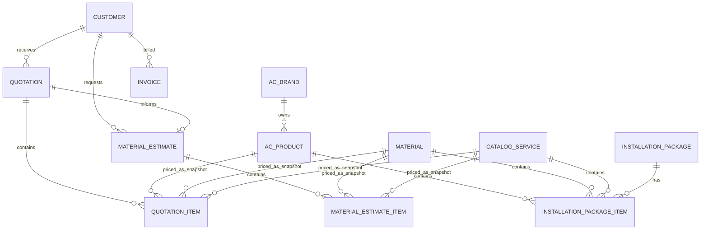

# Master Pricelist AC

## ERD

## Transaction Rules

- `QuotationItem` and `MaterialEstimateItem` retain cost and sell-price snapshots. Updating a master record does not alter a historic quotation, invoice conversion, profit report, or estimate.
- A quotation is converted to an existing `Invoice` and `InvoiceItem` structure with the quotation number in `Invoice.spo`.
- Inactive masters are excluded from selector APIs but retained for historical references.
- Apply the migration with `flask --app app db upgrade`, then use **Seed Master Indonesia** on the Master Pricelist page for brands, common services/materials, and the Gree F5S example.

## REST API

| Method | Endpoint | Purpose |
| --- | --- | --- |
| GET/POST | `/api/master-pricelist/products` | List/create AC products |
| GET/POST | `/api/master-pricelist/materials` | List/create materials |
| GET/POST | `/api/master-pricelist/services` | List/create services |
| GET/POST | `/api/master-pricelist/packages` | List/create installation packages |
| PATCH/DELETE | `/api/master-pricelist/<resource>/<id>` | Update / soft deactivate master data |
| POST | `/api/master-pricelist/load-calculator` | Calculate electrical load |